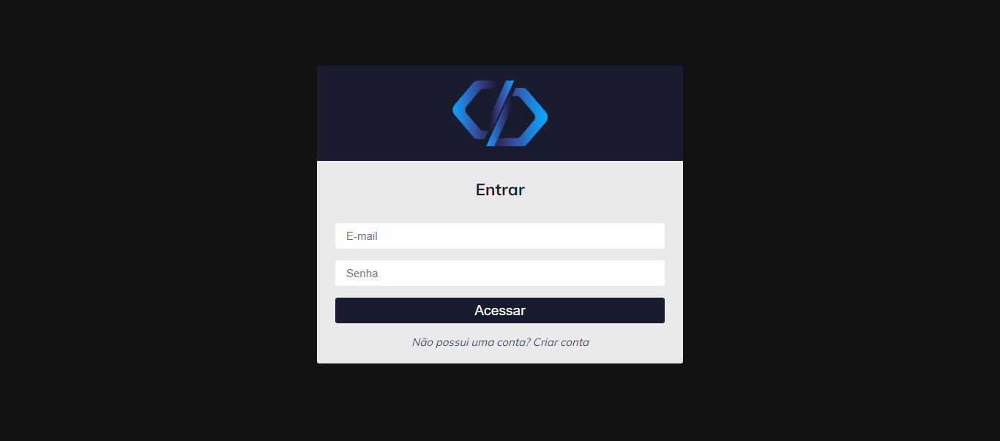
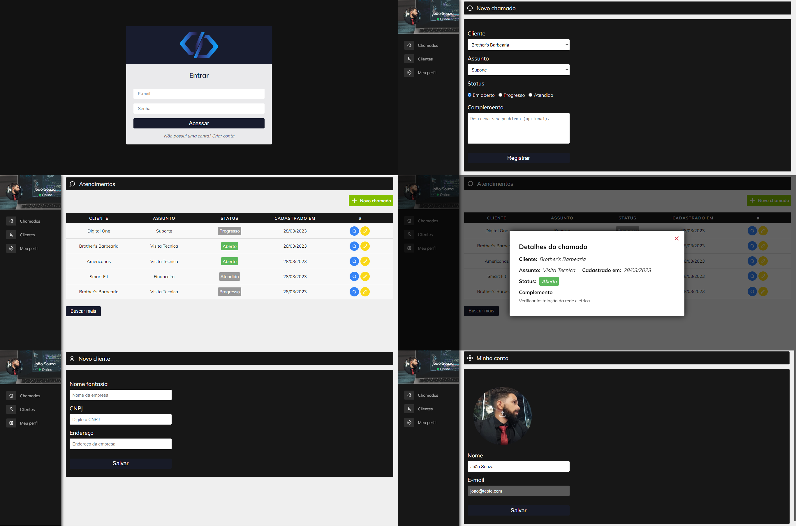

<h1 align="center">
    
</h1>

<h4 align="center"> 
	<p>Sistema de Chamados</p>
</h4>

<p align="center">
  

  
	
  
</p>

<p align="center"> 
    <a href="https://sistemachamados-joaosouza07.netlify.app/">Clique aqui para visitar o projeto</a>
</p>


## 💻 Sobre o projeto

🎫 Esse é um sistema de chamados desenvolvido em aulas do curso **Fábrica de Aplicativos** ministrado pelo **Matheus Fraga**, fundador da <a href="https://sujeitoprogramador.com/">Sujeito Programador</a> com algumas modificações feitas por mim. O projeto conta com cadastro e login de usuários, registro de clientes, bem como cadastro e edição de chamados.

Os usuários poderão se cadastrar na plataforma enviando:
- Nome
- E-mail
- Senha


## 🎨 Layout

### Web

<p align="center" style="display: flex; align-items: flex-start; justify-content: center;">
  
</p>


### Mobile
<p align="center" style="display: flex; align-items: flex-start; justify-content: center;">
  
</p>

## 🛠 Tecnologias

As seguintes ferramentas foram utilizadas no desenvolvimento do projeto:

- [HTML](https://developer.mozilla.org/en-US/docs/Web/HTML)
- [CSS](https://www.w3.org/Style/CSS/Overview.en.html)
- [JavaScript](https://developer.mozilla.org/en-US/docs/Web/JavaScript)
- [ReactJS](https://reactjs.org/)
- [Firebase](https://firebase.google.com/?hl=pt-br)


## 🎲 Como executar o projeto?

### Pré-requisitos

Antes de começar, você vai precisar ter instalado em sua máquina as seguintes ferramentas:
[Git](https://git-scm.com), [Node](https://nodejs.org/). Além disso, é fundamental ter um bom editor para trabalhar com o código, como por exemplo o [VSCode](https://code.visualstudio.com/).


### 🧭 Rodando a aplicação web (Front-End)


```bash
# Clone este repositório
$ git clone 

# Acesse a pasta do projeto no seu terminal/cmd
$ cd sistema-chamados

# Instale as dependências do projeto
$ npm install

# Execute a aplicação
$ npm start 

# A aplicação será aberta na porta:3000
# Acesse http://localhost:3000
```

## 📝 Licença

Este projeto esta sobe a licença [GNU](./LICENSE).

Feito com ❤️ por João Souza | [Entre em contato!](https://www.linkedin.com/in/joaosouzadesenvolvedorweb)